DO YOU KNOW YOUR AIRPORT SIGNS, MARKINGS & LIGHTS?

1. 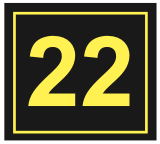 This sign identifies the runway upon which your aircraft is currently located.

2.  This sign indicates thousands of feet remaining to the end of the runway.

3. 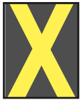 This marking means the runway or taxiway is closed.

4. 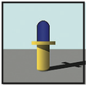 These lights outline the edges of a runway.

5. 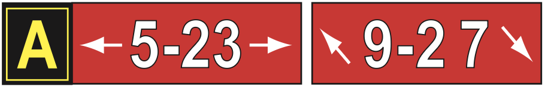 This array is located at the intersection of two runways and a taxiway.

6. 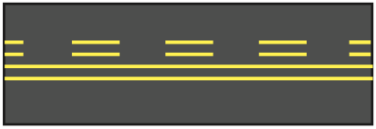 When seen on a taxiway in conjunction with a red and white runway identifier sign, this surface-painted marking indicates that an aircraft or vehicle may taxi up to but not cross the double solid lines until instructed to proceed by ATC.

7. 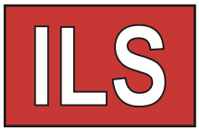 An aircraft that taxis past this sign may interfere with the navigational landing aid signals that an approaching aircraft is using. Stop if directed to by ATC.

8. 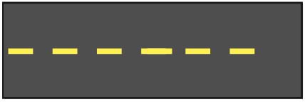 Stopping behind this marking will ensure wingtip clearance for aircraft on an intersecting taxiway.

9. 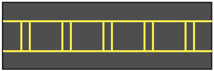 This painted marking indicates the edge of the ILS critical area. Ground control may ask you to hold short of this marking if an aircraft is using the ILS.

10. 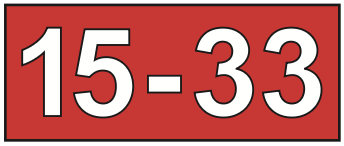 This sign alerts of an approaching runway and is accompanied by a yellow, surface-painted runway holding position marking.

11. 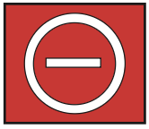 This no entry sign denotes that aircraft are prohibited from proceeding beyond it.

12. 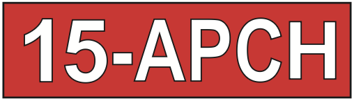 Taxiing past this sign may interfere with operations on the runway. Stop if directed to by ATC.

13. 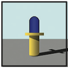 These lights outline the edges of a taxiway.

14. 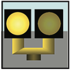 These lights are sometimes installed on each side of a taxiway prior to its intersection with a runway.

15. 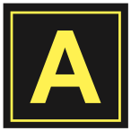 This sign identifies the taxiway upon which you are located.

16. 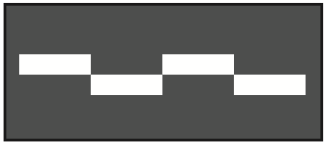 This marking indicates the edge of a path for vehicle traffic on areas also intended for aircraft.

17. 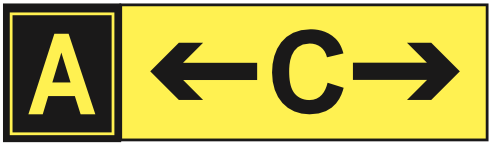 This array indicates that you are approaching the intersection of two taxiways.

18. 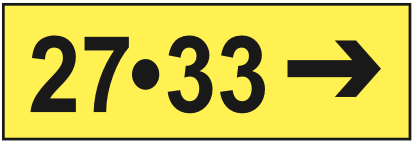 This sign indicates the direction to a destination runway.

19. 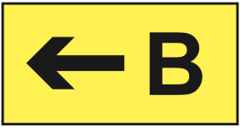 This sign indicates an exit from a runway onto the designated taxiway.

20. 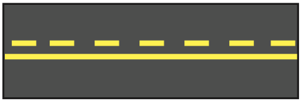 This surface-painted marking separates the movement and non-movement areas on the airport. ATC clearance is needed to move beyond the solid line onto the movement area.

21. 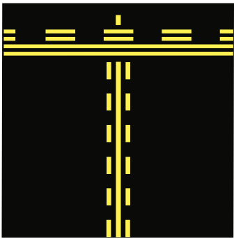 This surface-painted enhanced taxiway centerline marking runs up to 150 feet back from the holding position marking and alerts of an approaching runway

WWW.FAA.GOV/AIRPORTS/RUNWAY_SAFETY

